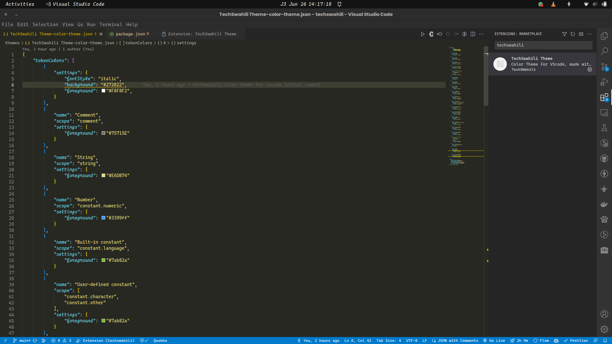

# TechSwahili Color Scheme

# TechSwahili Color Theme Extension

TechSwahili Color Theme is a vibrant and visually appealing color theme for Visual Studio Code that combines the beauty of Swahili culture with a developer-friendly coding environment. With this theme, you can bring a touch of East African flair to your coding experience.

## Features

- **Rich Color Palette**: The TechSwahili Color Theme offers a carefully curated selection of colors inspired by the vibrant culture of East Africa. The harmonious blend of hues enhances readability and makes your code visually engaging.

- **Language Support**: The color theme has been designed to provide optimal syntax highlighting for a wide range of programming languages and file types. Whether you're writing code in JavaScript, Python, HTML, CSS, or any other language, TechSwahili Color Theme ensures a consistent and enjoyable coding experience.

- **Accessibility**: We believe in inclusivity and strive to make our theme accessible to all users. The TechSwahili Color Theme meets the accessibility standards by maintaining a suitable contrast ratio, making it easier for users with visual impairments to read and write code.

## Installation

1. Launch Visual Studio Code.

2. Go to the Extensions view by clicking on the square icon in the left sidebar or by pressing `Ctrl+Shift+X`.

3. Search for "TechSwahili Theme" and click on the "Install" button for the extension published by Ramadhanmkoma.

4. Once installed, go to `File -> Preferences -> Color Theme` and select "TechSwahili Color Theme" from the dropdown menu.

## Feedback and Contributions

We welcome any feedback, suggestions, or bug reports related to the TechSwahili Color Theme Extension. Feel free to [open an issue](https://github.com/Ramadhanmkoma/VSCode-Color-Theme-Extension) on our GitHub repository.

If you would like to contribute to the development of this color theme, please follow our [contribution guidelines](CONTRIBUTING.md).

## License

The TechSwahili Color Theme Extension is released under the [MIT License](LICENSE.md). Feel free to use, modify, and distribute the theme according to the terms of the license.

---

Get ready to code in style with the TechSwahili Color Theme Extension! If you enjoy using our theme, don't forget to share it with your fellow developers.

Happy coding! 🚀
